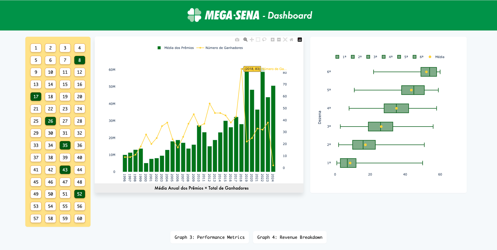

# Dashboard da Mega-Sena

## Visão Geral
Este projeto é um dashboard para visualização de resultados da Mega-Sena, a loteria mais popular do Brasil. O dashboard permite aos usuários visualizar os últimos resultados, analisar frequências de números, entre outros insights estatísticos.

## Prévia - Por Enquanto



## Recursos
- Visualização dos resultados dos últimos sorteios.
- Análise de dados históricos dos sorteios.
- Frequência de ocorrência dos números sorteados.

## Tecnologias Utilizadas
As tecnologias específicas utilizadas neste projeto não foram detalhadas. Para contribuir ou entender melhor as tecnologias, considere explorar o código do projeto ou entrar em contato com os mantenedores.

## Como Começar
Para executar uma cópia local do projeto, siga estes passos simples.

### Pré-requisitos
- Certifique-se de ter todas as ferramentas necessárias para executar um projeto Node.js, caso ele utilize essa tecnologia.

### Instalação
1. Clone o repositório
   ```sh
   git clone https://github.com/saitoi/mega-sena-dashboard.git
   ```

## Contribuindo
Contribuições são sempre bem-vindas. Para contribuir, faça um fork do projeto, crie uma branch para sua feature, faça os commits e abra um pull request.

## Contato
Para mais informações, entre em contato com o mantenedor do projeto através do GitHub.

Link do Projeto: [https://github.com/saitoi/mega-sena-dashboard](https://github.com/saitoi/mega-sena-dashboard)
